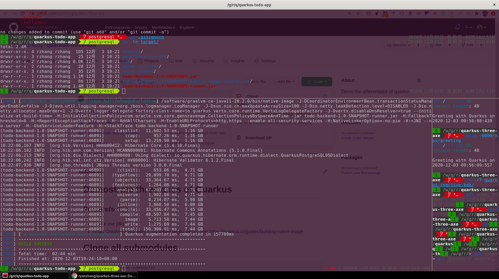

# TODO Application with Quarkus
Todo app with UI and postgresql as backend. 

In order to run the program, please run the database first

Please run the database as following:
## Postgres - Run database
```bash
# memlock requires sudo permission
sudo podman  run --ulimit memlock=-1:-1 -it --rm=true --memory-swappiness=0 \
    --name -qpostgresuarkus-rest-http-crud -e POSTGRES_USER=restcrud \
    -e POSTGRES_PASSWORD=restcrud -e POSTGRES_DB=rest-crud \
    -p 5432:5432 postgres:10.5
```

or

```bash
docker run --ulimit memlock=-1:-1 -it --rm=true --memory-swappiness=0 \
    --name postgres-quarkus-rest-http-crud -e POSTGRES_USER=restcrud \
    -e POSTGRES_PASSWORD=restcrud -e POSTGRES_DB=rest-crud \
    -p 5432:5432 postgres:10.5
```


Branches:

* `master` - use H2 (in memory), no native support
* `postgresql` - use posgresql, support native mode 

## Compilation

```bash
mvn package
java -jar target/todo-backend-1.0-SNAPSHOT-runner.jar
```
Then, open: http://localhost:8080/


## Development mode

```bash
mvn compile quarkus:dev
```
Then, open: http://localhost:8080/


## Native Compilation
```bash
mvn clean package -Pnative -DskipTests
```


## Demo batch running the native binary mode
```bash
#This only apply to fish shell
for i in (seq 8000 8250); QUARKUS_HTTP_PORT=$i target/todo-backend-1.0-SNAPSHOT-runner > /tmp/todo-app-$i.log&;end; sh time-to-first-response.sh;

#watch the process 'top' data
top -bc |grep "runner"

# try
http :8000/hello

#check rss for specific pid
ps -o pid,rss yourprocessid

killall target/todo-backend-1.0-SNAPSHOT-runner
```

## Demo batch running JVM mode
```bash
#This only apply to fish shell
for i in (seq 8000 8050); QUARKUS_HTTP_PORT=$i java -jar target/todo-backend-1.0-SNAPSHOT-runner.jar > /tmp/todo-app-$i.log&;end; sh time-to-first-response.sh;

#watch the process 'top' data
top -bc |grep "runner"

# try
http :8000/hello

#check rss for specific pid
ps -o pid,rss yourprocessid

killall java
```

## time-to-first-response.sh
```bash
#/bin/bash
date
while [[ "$(curl -s -o /dev/null -w ''%{http_code}'' localhost:8000/todo.html)" != "200" ]]; do sleep .00001; done
echo First response completed
date
```

## Build for production
QUARKUS_PROFILE=PROD  mvn clean package


